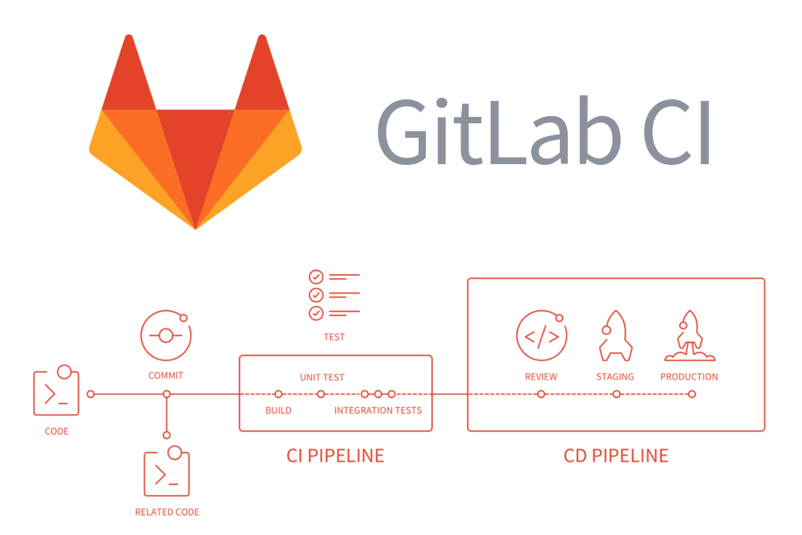
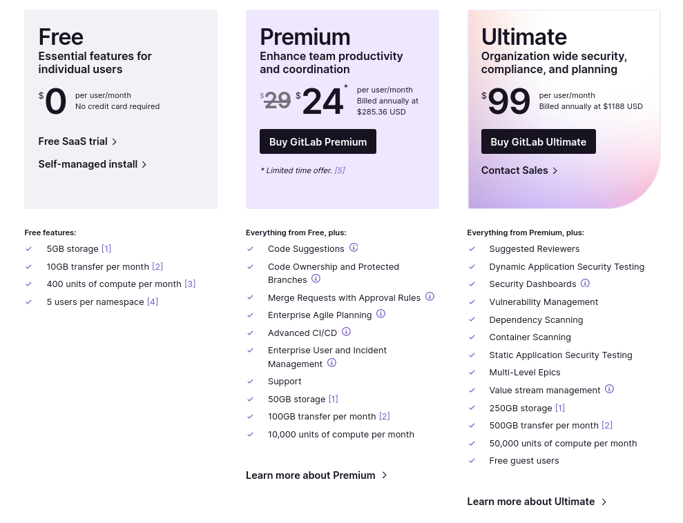
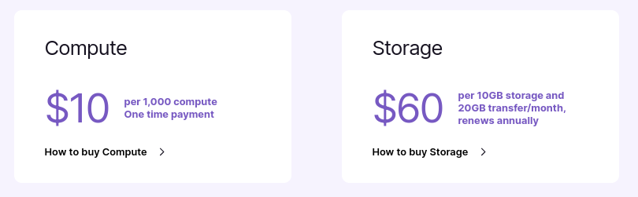
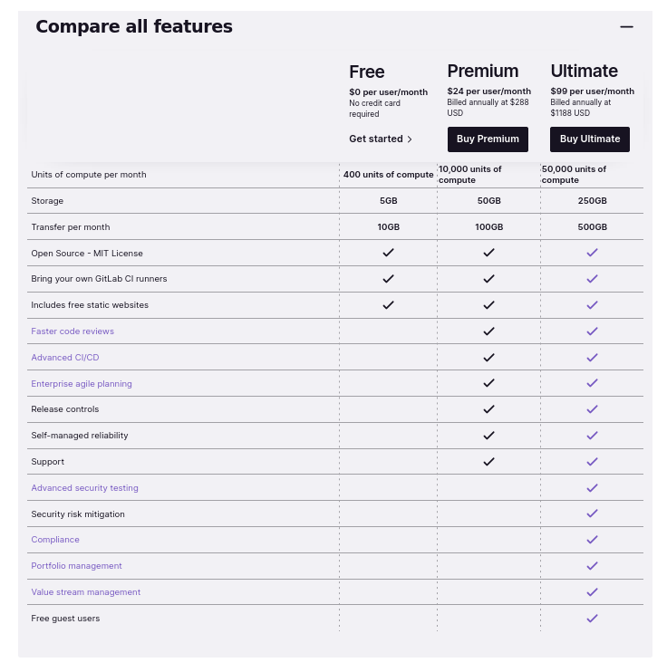
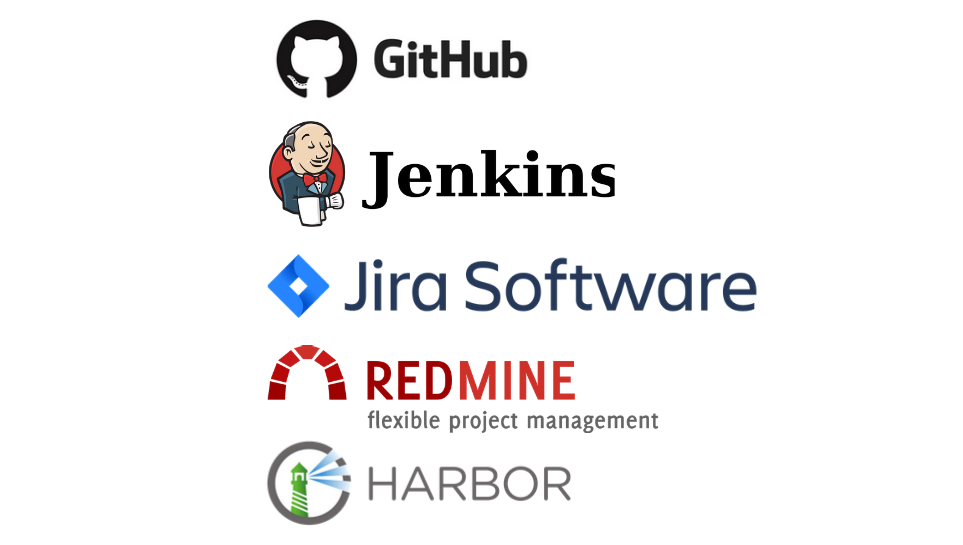

## ÍNDICE
- [¿Qué son las herramientas CI/DC?](#qué-son-las-herramientas-cicd)

- [¿Qué es y dentro de que grupo de las herramientas CI/DC está?](#qué-es-y-dentro-de-que-grupo-de-las-herramientas-cicd-está)

- [¿Qué ofrece?](#qué-ofrece)

- [Plan de precios.](#plan-de-precios)

- [Ejemplo de integración con repositorios de código](#ejemplo-de-integración-con-repositorios-de-código)

- [Ejemplo de documentación de proyectos](#ejemplo-de-documentación-de-proyectos)

- [Otras herramientas con las que se integra](#otras-herramientas-con-las-que-se-integra)

- [Comparativa con otras herramientas](#comparativa-con-otras-herramientas)

- [¿Por qué escoger la herramienta frente a otras?](#por-qué-escoger-la-herramienta-frente-a-otras)

- [Referencias](#referencias)

## Qué son las herramientas CI/CD

Las herramientas CI/CD hacen referencia a un método para distribuir las aplicaciones a los clientes con frecuencia, mediante el uso de la automatización en las etapas del desarrollo de las aplicaciones. Los principales conceptos que se le atribuyen son la Integración Continua (CI) y la Distribución e Implementación Continua (CD). 

### Integración Continua (IC)
La Integración Continua es una práctica de desarrollo que requiere que los desarrolladores integren su código en un repositorio compartido con el resto de sus compañeros, varias veces al día.

Cada rama, es verificada automáticamente por un compilador, permitiendo al equipo de programadores detectar los diferentes problemas que puedan existir y solucionarlos lo antes posible, asegurando de esta forma que la rama "main", siempre se encuentre lo más limpia y viable posible para su posterior desarrollo.

__Objetivo:__ Entregar un código mejor, más rápido y fácil de mantener.

### Distribución e Implementación Continua (CD)
La Distribución e Implementación Continua es la etapa que procede a la Integración Continua. Sin embargo, dentro de ésta, se pueden diferenciar dos conceptos en los que, aunque a menudo se confundan y se usen indistintivamente, ya que ambos se refieren a la automatización de las etapas posteriores del proceso, se usan por separado para explicar hasta dónde llega la automatización.

- __Distribución Continua:__
La Distribución Continua es la etapa donde los cambios realizados con éxito en la Integración Continua son cargados en un repositorio, para que luego el equipo de operaciones pueda implementarlos en un entorno de producción en vivo.

    - **Objetivo:** Mejorar la poca supervisión y comunicación entre los equipos comerciales y de desarrollo y garantizar que la implementación del código nuevo se lleve a cabo con el mínimo esfuerzo.

- __Implementación Continua:__ 
La Implementación Continua hace referencia al lanzamiento automático de los cambios que implementa el desarrollador desde el repositorio hasta la producción, para ponerlos a disposición de los clientes. 

    - **Objetivo:** No sobrecargar a los equipos de operaciones con procesos manuales que retrasan la distribución de las aplicaciones y aprovechar los beneficios de la distribución continua automatizando la siguiente etapa del proceso.

## Qué es y dentro de que grupo de las herramientas CI/CD está
Gitlab es un servicio web de forja, control de versiones y ___DevOps*___ basado en Git y publicado bajo una licencia de código abierto. Es una herramienta que se encuentra en el grupo de herramientas CI/CD, lo que significa que ofrece características tanto de Integración Continua (CI) como de Despliegue Continuo (CD). Permite automatizar y orquestar el proceso de desarrollo, pruebas y despliegue de software, brindando una solución integral para respaldar las prácticas ágiles de desarrollo y las metodologías de DevOps.

Fue escrito en 2011 por los programadores ucranianos Dmitriy Zaporozhets y Valery Sizov en el lenguaje de programación Ruby3​ y Go, inicialmente como una solución de gestión de código fuente para colaborar con su equipo en el desarrollo de software. Luego evolucionó a una solución integrada que cubre el ciclo de vida del desarrollo de software, y luego a todo el ciclo de vida de DevOps. La arquitectura tecnológica actual incluye Go, Ruby on Rails y Vue.js.

La compañía, GitLab Inc. cuenta con un equipo de 1309 miembros. Es usado por organizaciones como la NASA, el CERN, IBM o Sony.

- - - 
___*DevOps:__ Es una metodología que busca integrar el desarrollo de software (Dev) con las operaciones de tecnología de la información(Ops). Estas operaciones se refieren a las actividades y procesos relacionados con la gestión y el mantenimiento de los sistemas de tecnología de la información en una organización: Gestión de infraestructura, soporte técnico, monitoreo y seguridad..._

:sound: <a href="https://youtu.be/l5705U8s_nQ?t=369">Profundiza un poco más en Gitlab CI/CD</a>

## Qué ofrece

- Uno de los aspectos mas conocidos de GitLab es que se puede usar como herramienta única para todo el ciclo CI/CD, esto no solo supone una mayor comodidad y simplicidad, sino que tambien beneficia mucho en la seguridad, ya que todas las etapas del ciclo DevOps se controlan desde un único entorno. 

- Otro de sus puntos principales es el amplio catálogo de integraciones con aplicaciones externas, ofreciendo un ambiente y una plataforma en la que pueden converger las funcionalidades y puntos fuertes de muchas herramientas. 

- También que se pudeda preparar y ser host de nuestro propio servidor con infraestructura personalizada de forma gratuita lo cual además permite trabajar en ellos sin necesidad de estar conectado

- Otras cualidades también pueden ser:
    - Alojamiento de wikis
    - Repositorios privados gratuitos
    - Sistema de seguimiento y detección de errores
    - Posibilidad de crear ramas y pull requests directamente dedicadas a los issues
    - Registro en docker gratuito por repositorio
    - Pîpelines para mas de un proyecto
    - Registro de contenedores (no es necesario el de docker)
    - División de proyectos por grupo

## Plan de precios

- Versión Gratuita: Adecuada para equipos pequeños. 

    - Incluye funciones básicas de gestión de proyectos como la gestión de problemas y ramas y la integración continua, además de funciones básicas de seguridad y soporte comunitario en línea. 

    - 5gb de espacio de almacenamiento, 10gb de transferencia mensual, 400 unidades de computación mensuales y un límite de 5 usuarios por espacio.

- Versión Premium: Adecuado para proyectos de medianos a grandes en entornos empresariales. 

    - Añade funciones avanzadas como la gestión de cartera de proyectos, mejor personalización de procesos e integración con herramientas de terceros. 

    - Mejores funciones de seguridad y cumplimiento tales como la administración avanzada de usuarios, gestión avanzada de permisos y accesos de los usuarios, lo que implica mejores políticas de seguridad, características avanzadas de CI/CD, escaneo de vulnerabilidades, mayor eficiencia en el análisis de código. Además de soporte técnico especializado. 

    - 50gb de espacio de almacenamiento, 100gb de transferencia mensual y 10.000 unidades de computación mensuales.
    
- Versión Ultimate: Adecuado para entornos empresariales de gran escala. 

    - Incluye agrupación de proyectos para mejor administración,  gestión de operaciones y de valor empresarial, permisos y roles más complejos, herramientas avanzadas de cumplimiento, como auditorías, informes y flujos de trabajo personalizados, además de nuevas integraciones empresariales.

    - Adiciones de seguridad y cumplimiento como el escaneo de dependencias y contenedores, detección de vulnerabilidades en tiempo real, gestión de identidades y accesos, políticas de seguridad y registros de auditoría. Además de soporte técnico prioritario y asistencia en línea y presencial. 

    - 250gb de espacio de almacenamiento, 500gb de transferencia mensual y 50.000 unidades de computación mensuales.

### Extras

### Comparativa

## Ejemplo de integración con repositorios de código
Gitlab es una herramienta con una amplia gama de aplicaciones con las que se puede integrar. En este caso, nosotros hemos elegido Asana. Una aplicación web y móvil para la gestión de tareas, que está diseñada para facilitar a las personas y a los equipos la planificación y la gestión de sus proyectos. Cada equipo tiene un espacio de trabajo. Los espacios de trabajo contienen proyectos y los proyectos contienen tareas.

Actualmente esta tecnología es usada por empresas como Paypal, Spotify o Amazon entre otras muchas más.

- Paso 1: Loging en Asana.
- Paso 2: Integración a través de Unito. App que es capaz de crear un flujo de trabajo con integraciones personalizables y de autoservicio, que permiten a todos los miembros del equipo trabajar en la herramienta de su elección sin perderse nada gracias a una sincronización bidireccional automatizada y sin código.

## Conecta tus herramientas

## Establezca la dirección de flujo entre sus herramientas

## Elija las tareas que desea sincronizar

## Resultado

## Ejemplo de documentación de proyectos
## Repositorios

## Wikis
Si no quieres tener tu documentación en tu repositorio, pero quieres mantenerla en el mismo proyecto que tu código, puedes usar el wiki que GitLab proporciona en cada proyecto GitLab. Cada wiki es un repositorio Git separado, así que puedes crear páginas wiki en la interfaz web, o localmente usando Git. Además, si utilizas grupos de GitLab para gestionar varios proyecto, puedes crear wikis de grupo, en lugar de wikis de proyecto, para asegurarte de que todos los miembros del grupo tienen los permisos de acceso correctos para contribuir.

Los wikis de GitLab soportan Markdown, Rdoc, AsciiDoc y Org para el contenido. Además, aportan diferentes funcionalidades, como puede ser la rápida creación de tablas, menús desplegables e incluso un propio sistema de creación y edición de diagramas.

## Otras herramientas con las que se integra

Gitlab posee una gran librería de herramientas para su integración, aquí podemos ver algunas de las que conocemos y henos visto:

### Ejemplo: Jira

La integración con jira se puede hacer desde dos maneras

- Integración del sistema de Issues:
    - Crear y ver issues de Jira directamente desde gitlab
    - Referenciar issues de Jira por id desde commits y merge requests de GitLab
    - Crear issues de jira para vulnerabilidades

- Integración del panel de desarrollos
    - Incluidas las ramas referenciales, commits y merge requests.
    - Seguimiento de tiempo en un issue
    - Uso de commits para transición o cierre de un issue (commits inteligentes)

## Comparativa con otras herramientas

En este caso haremos la comparativa entre GitLab y GitHub, ya que son las herramientas que mas conocemos y tienen un rango similar.

- La primera diferencia que se aprecia es que gitlab es una aplicación de código abierto, mientras que github es propietario y no se puede ve rni modificar.

- Mientras que GitHub sigue dependiendo en gran parte de empresas de terceros para la Integración Continua, GitLab se puede usar como herramienta única para todo el ciclo CI/CD, esto no solo supone una mayor comodidad y simplicidad, sino que tambien beneficia mucho en la seguridad, ya que todas las etapas del ciclo DevOps se controlan desde un único entorno. 

- En general todo lo relacionado con las herramientas CI/DC está mejor planteado en GitLab ya que estos llevan años perfeccionandolas mientras que GitHub las ha implementado hace relativamente poco tiempo.

- A diferencia de GitHub, GitLab no está planteado como una red social, por lo que muchas adiciones como los perfiles de usuario, starrings, etc... no se van a encontrar en este. 

- GitLab permite asociar runners a múltiples repositorios con mayor facilidad.

## ¿Por qué escoger la herramienta frente a otras?

## Referencias
https://www.redhat.com/es/topics/devops/what-is-ci-cd

https://docs.gitlab.com/

https://marketplace.visualstudio.com/items?itemName=GitLab.gitlab-workflow#browse-a-repository-without-cloning

